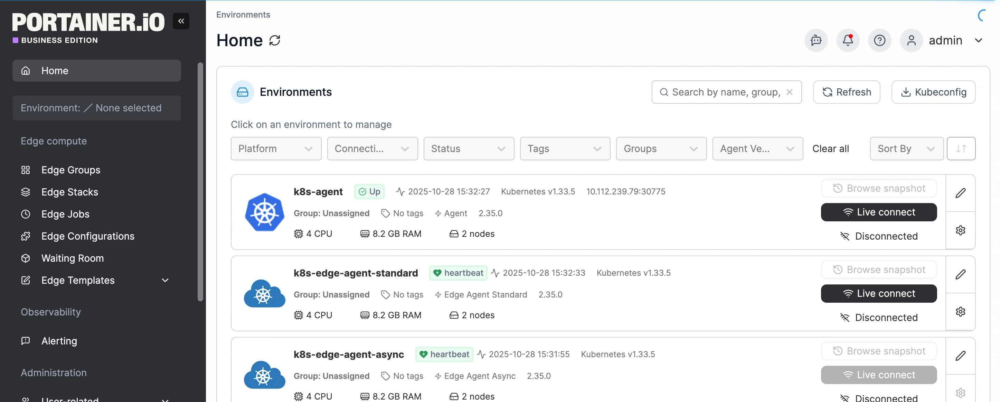
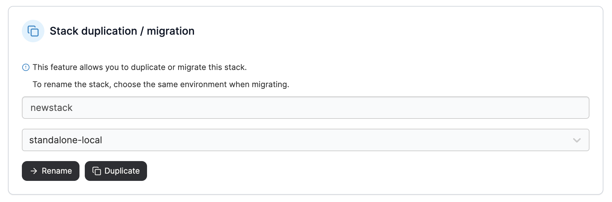

# What's new in version 2.36

Portainer version 2.36 includes a number of new fixes and updates. For a full list of changes, please refer to our [release notes](release-notes.md).

## Short Term Support (STS)

2.36 is a Short Term Support, or "STS", release of Portainer. STS releases intended to be an introduction of new features and functionality in Portainer, and while we do perform significant testing prior to release are not recommended for production use. For production, we recommend staying with the Long Term Support (LTS) releases. The features that appear in STS releases will, once refined and stable, be implemented in the next LTS release.

You can read more about our release principles in our [lifecycle policy](start/lifecycle.md).

## New in this release

### Inspect Kubernetes CRDs and custom resources &#x20;

Portainer now lets admins [review Kubernetes Custom Resource Definitions (CRDs)](user/kubernetes/more-resources/custom-resources.md) and their custom resources directly from the UI. You can inspect objects via YAML or view a detailed summary equivalent to `kubectl describe`.&#x20;

<figure><figcaption></figcaption></figure>

### Rename a Stack  

You can now [rename an existing stack](user/docker/stacks/migrate.md#rename-a-stack) under the Stack duplication / migration feature.

<figure><figcaption></figcaption></figure>

### Support for Docker Engine 29  

Portainer now includes initial [support for Docker Engine 29](start/requirements-and-prerequisites.md). Docker 29 introduced several breaking changes that prevented Portainer from connecting to environments running this version. We have updated our code to restore compatibility so users can run Portainer with the latest Docker release. Support is focused on restoring stable operation, and additional Docker 29 features will be added in future releases.
