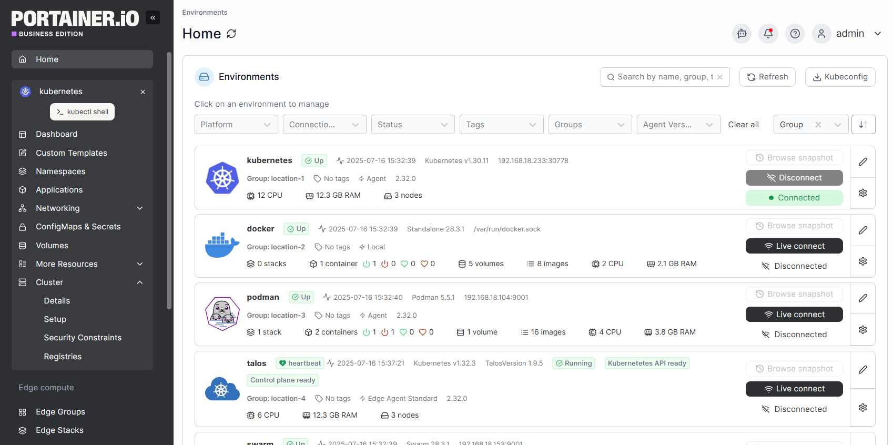
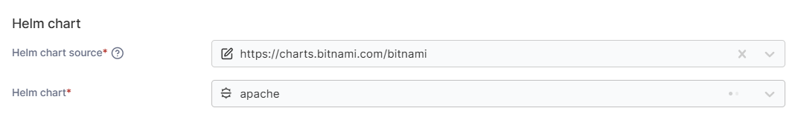
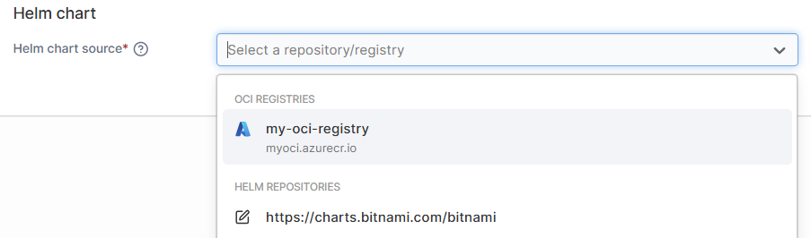
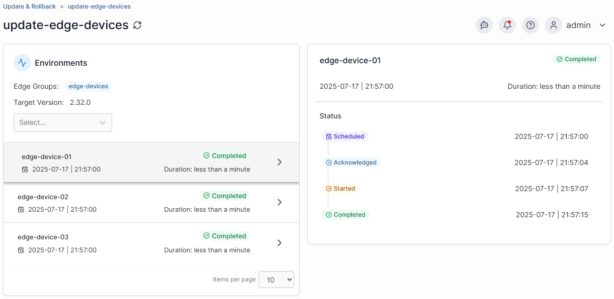
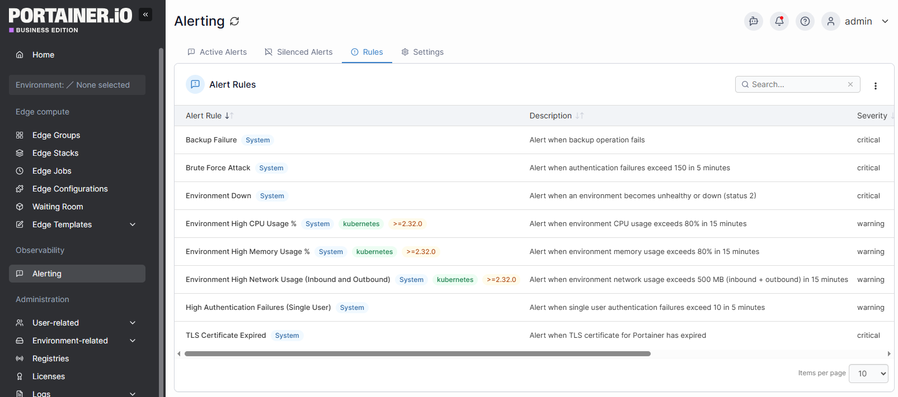

# What's new in version 2.32

Portainer version 2.32 includes a number of new fixes and updates. For a full list of changes, please refer to our [release notes](release-notes.md).

## Short Term Support (STS)

2.32 is a Short Term Support, or "STS", release of Portainer. STS releases intended to be an introduction of new features and functionality in Portainer, and while we do perform significant testing prior to release are not recommended for production use. For production, we recommend staying with the Long Term Support (LTS) releases. The features that appear in STS releases will, once refined and stable, be implemented in the next LTS release.

You can read more about our release principles in our [lifecycle policy](start/lifecycle.md).

## New in this release

### A new look  

The first change you'll notice in this release is a new look. We've updated and modernized the Portainer branding alongside this release, both in the application and on our website. What you see in 2.32 is the first phase of this new branding - expect to see more adjustments to this in subsequent releases.

<figure><figcaption></figcaption></figure>

### Expanded Helm chart functionality  

2.32 continues the work on Helm even further. We've streamlined the way that we retrieve charts from Helm repositories to improve load times, and we've added functionality around Helm chart versions to allow you to manually refresh the version list on-demand.&#x20;

<figure><figcaption></figcaption></figure>

You can now also select chart sources for your deployments, allowing you to easily track where they came from and what changes you have made to your configuration compared to upstream sources.

<figure><figcaption></figcaption></figure>

### Support for OCI format Helm charts 

Version 2.32 introduces support for OCI-format Helm charts via OCI registries. These registries are configured in the same way as image registries, and any registries you currently have configured (and have given access to the respective namespace) that contain OCI charts will appear in the new Helm chart source dropdown when creating a deployment from Helm.

<figure><figcaption></figcaption></figure>

### Update & Rollback overhaul 

This release sees an overhaul of the Update & Rollback functionality for Edge devices. We've refreshed the UI and now provide additional status detail at the list of schedules. We've also expanded the schedule detail view to provide much more information including per-device status reports so you can confirm that all devices in the group were updated as expected.

<figure><figcaption></figcaption></figure>

### Experimental: Observability 

We've also introduced a new experimental feature in 2.32 - Observability. With this prototype feature enabled, you can configure notifications to be sent on various conditions affecting your environments through various mechanisms (for example Slack, email, or via a webhook).&#x20;

<figure><figcaption></figcaption></figure>

This feature is very much an experimental feature, and as such we highly advise against enabling this on a production environment.

As the initial release of this functionality we are keen to get your feedback on what we can add or improve in the future.
