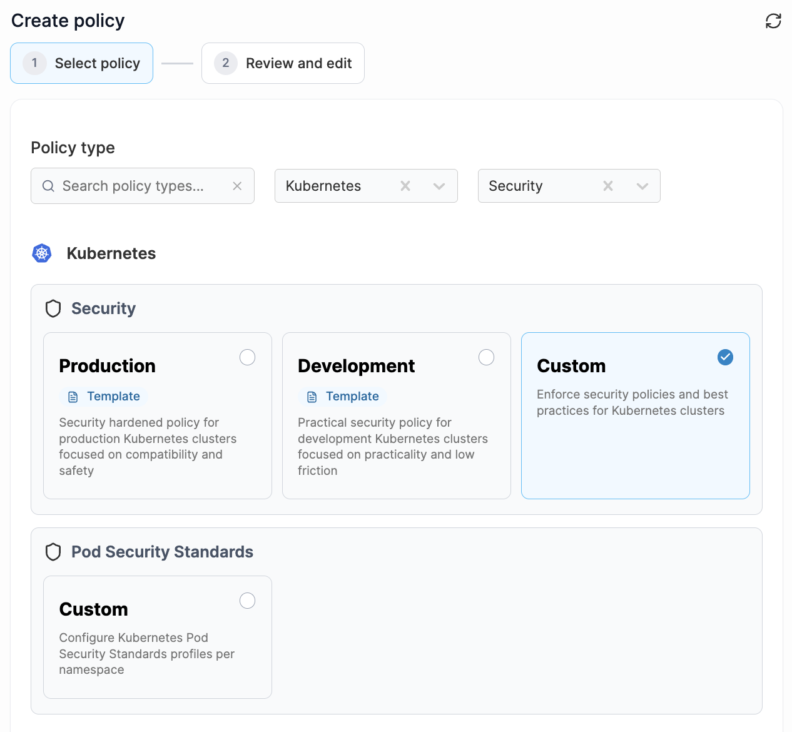
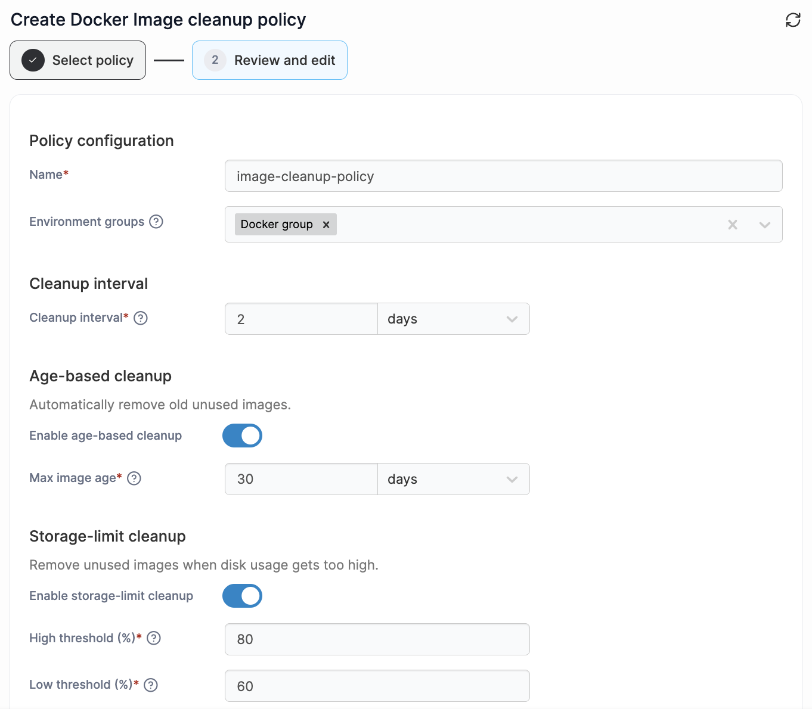

# What's new in version 2.45

Portainer version 2.45 includes a number of new features and fixes, bringing the changes from the previous STS releases into the LTS stream. For a full list of changes, please refer to our [release notes](release-notes.md).



## Long Term Support (LTS) 

2.45 is a Long Term Support, or "LTS", release of Portainer. LTS releases are intended to to be solid, tested, production-ready versions of Portainer, suitable for running in both testing and production environments. LTS releases generally do not have any additional features as compared to the previous STS release, but rather are a consolidation of all the new features and changes that have gone into the previous STS releases but with additional polishing and testing.

You can read more about our release principles in our [lifecycle policy](start/lifecycle.md).

## New in this release

### A new look for the home page  

The [home page](user/home/) has been refreshed as part of Portainer's ongoing UI update. Environments are now displayed in helpful groupings, making it easier to spot environments that are down or unassigned. You can now sort your environments by group, platform, or health.

<figure><figcaption></figcaption></figure>

### Portainer Add-ons &#x20;

Portainer now supports installable [add-ons](admin/add-ons/) - purpose-built tools that extend Portainer and run alongside it in your local Kubernetes cluster. Each add-on deploys as a Helm release and appears in the sidebar switcher; admins can install, upgrade, restart, and uninstall add-ons from a central catalog, monitor health via Resources, Events, and Logs tabs, and control team access. The first add-on, [Portainer-Run](https://portainer.ai/), is available now.

<figure><figcaption></figcaption></figure>

### New policies 

Portainer now offers several new [policy](admin/environments/policies/) types to help enforce security and governance across your environments:

* [Banner and Custom Change Confirmation policy](admin/environments/policies/any-environment-type-policies/create-a-banner-and-change-confirmation-policy.md) - display a custom banner across a group of environments (Docker or Kubernetes) and require a confirmation prompt before changes are applied.
* [Pod Security Standards policy](admin/environments/policies/kubernetes-policies/create-a-kubernetes-pod-security-standards-policy.md) - apply Kubernetes' built-in privileged, baseline, or restricted profiles per namespace, independently for enforce, audit, and warn modes.
* [Kubernetes Network Security policy](admin/environments/policies/kubernetes-policies/create-a-kubernetes-network-security-policy.md) - define ingress and egress rules for pods using presets or custom label-based rules, deployed as native Kubernetes `NetworkPolicy` objects.
* [Kubernetes observability policy](admin/environments/policies/kubernetes-policies/create-a-kubernetes-observability-policy.md) - connect Portainer to your [OneUptime](https://oneuptime.com/) instance to bring logs and metrics directly into the namespace details view. Choose to connect to an existing OneUptime agent or have Portainer deploy one for you.
* [Native Kubernetes RBAC support](admin/environments/policies/kubernetes-policies/kubernetes-rbac-policy.md) - Kubernetes RBAC policies now support a native Kubernetes permission model, alongside the existing legacy Portainer privileges model, with permissions accumulating across cluster, team, and namespace roles.

<figure><figcaption></figcaption></figure>

### GitOps improvements  

GitOps management is now centralized and easier to configure end to end:

* A new [Sources view](user/app-delivery/sources/) provides a central place to create, edit, and manage Git connections, replacing the previous per-workflow credential entry.
* A new guided [GitOps workflow creation](user/app-delivery/workflows/) flow lets you configure a source, stack file, deployment targets, environment variables, registry settings, and rollout strategy (including parallel batches with automatic pause or rollback) in one operation.
* A new [Workflows dashboard](user/app-delivery/workflows/) gives a unified view of Docker, Edge, and Kubernetes workloads deployed from Git, so you can assess deployment health and jump to any stack that needs attention.

<figure><figcaption></figcaption></figure>

### Docker image cleanup 

Keeping Docker environments tidy is easier with two new capabilities: [manual image pruning](user/docker/images/prune-dangling-and-unused-images.md) from the Images view (dangling images or all unused images), and [automated image cleanup policies](admin/environments/policies/docker-policies/cleanup-policy.md) that remove old or unused images on a schedule, based on age or storage thresholds, with the ability to protect specific images.

<figure><figcaption></figcaption></figure>

### Alerting improvements 

[Alerting](user/alerting/) has graduated to general availability, with several enhancements: select alert types now support multi-severity thresholds (critical, warning, info), the rules view adds category-based grouping and filtering, new Kubernetes rules cover etcd, API server, TLS certificate expiry, and NotReady nodes, and alert summaries now surface per-entity context for faster triage. Notifications can be sent to Slack, email, or Microsoft Teams.

<figure><figcaption></figcaption></figure>

### GPU visibility 

Kubernetes environments with detected GPU nodes now display a dedicated [GPU view](user/kubernetes/gpu.md) with three tables: a GPU summary (capacity, allocatable, allocated, and available counts, plus node health), a GPU Nodes table, and a GPU Workloads table showing per-pod GPU requests and scheduling status.

<figure><figcaption></figcaption></figure>

### New ways to back up Portainer 

Two [new backup destinations](admin/settings/general.md#back-up-portainer) are available: **scheduled local backup** on a defined cron schedule with configurable retention and a custom storage path, and **Azure Blob Storage**, joining S3 as a supported cloud destination for on-demand and scheduled backups.

<figure><figcaption></figcaption></figure>

### Add KubeSolo edge environments directly from Portainer &#x20;

You can now [onboard KubeSolo edge environments](admin/environments/add/add-a-kubesolo-edge-environment/) through the Environment Wizard, which generates the setup command and walks you through deploying the Portainer Edge Agent, whether KubeSolo is already running or being installed fresh.

<figure><figcaption></figcaption></figure>

### A dedicated node shell 

Administrators can now open a root shell directly on any cluster node from the [Nodes table](user/kubernetes/cluster/details/#nodes), without needing SSH. Disabled by default; enable per cluster in Cluster → Setup → [Security](user/kubernetes/cluster/setup.md#security), or centrally through a [Kubernetes Security Policy](admin/environments/policies/kubernetes-policies/kubernetes-security-policy.md).

<figure><figcaption></figcaption></figure>

### SSRF mitigation  

Portainer now includes [built-in SSRF mitigation](admin/settings/general.md#ssrf). Define an allowlist of permitted proxy destinations and choose how Portainer responds to requests outside that list: enforce (block), audit (log only), or take no action.

<figure><figcaption></figcaption></figure>

### New Recommendations view 

The new [Recommendations](admin/recommendations.md) view surfaces actionable suggestions when Portainer detects environment issues or configuration gaps, each with a direct action to take you straight to the relevant area for resolution.

<figure><figcaption></figcaption></figure>

### Manage Portainer using Terraform  

[Portainer can now be automated](whats-new.md#manage-portainer-using-terraform) using our [official Terraform provider](https://registry.terraform.io/providers/portainer/portainer/latest/docs), letting you manage environments, users, teams, stacks, and other resources as code, and integrate Portainer into existing Infrastructure as Code and CI/CD workflows.
