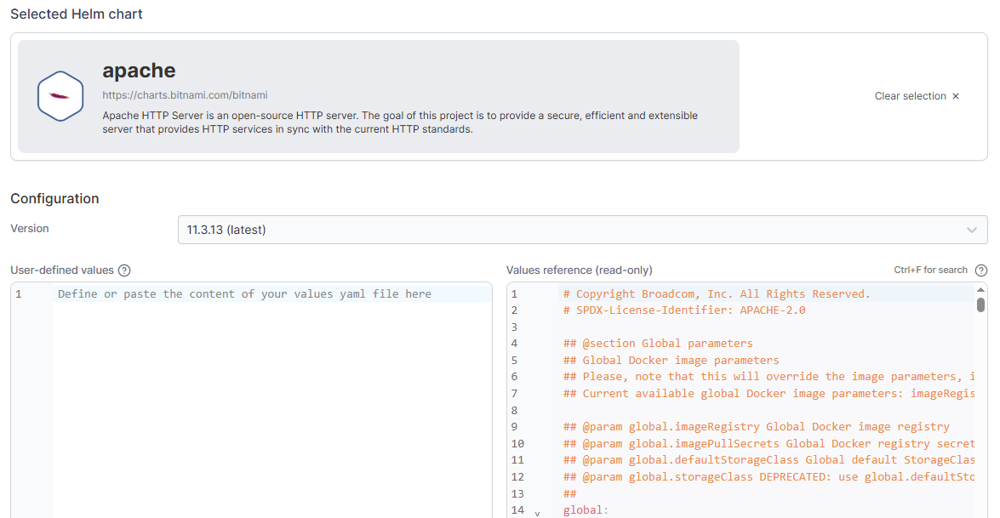

# What's new in version 2.31

Portainer version 2.31 includes a number of new fixes and updates. For a full list of changes, please refer to our [release notes](release-notes.md).

## Short Term Support (STS)

2.31 is a Short Term Support, or "STS", release of Portainer. STS releases intended to be an introduction of new features and functionality in Portainer, and while we do perform significant testing prior to release are not recommended for production use. For production, we recommend staying with the Long Term Support (LTS) releases. The features that appear in STS releases will, once refined and stable, be implemented in the next LTS release.

You can read more about our release principles in our [lifecycle policy](start/lifecycle.md).

## New in this release

### Expanded Helm chart functionality  

2.31 continues the work on Helm by expanding the options available when deploying a Helm chart from a repository. You can now choose the repository to list charts from when deploying an app, choose the specific version of a Helm chart to deploy, and more easily make changes to any default values using the comparison display.

<figure><figcaption></figcaption></figure>

This also adds some of the initial framework required to support OCI format charts, so expect to see that functionality in a future release.
