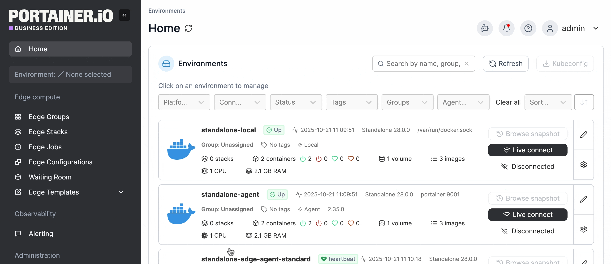

# What's new in version 2.24

Portainer version 2.24 includes a number of new fixes and updates. For a full list of changes, please refer to our [release notes](release-notes.md).

## Short Term Support (STS)

2.24 is a Short Term Support, or "STS", release of Portainer. STS releases intended to be an introduction of new features and functionality in Portainer, and while we do perform significant testing prior to release are not recommended for production use. For production, we recommend staying with the Long Term Support (LTS) releases. The features that appear in STS releases will, once refined and stable, be implemented in the next LTS release.

You can read more about our release principles in our CEO Neil's [blog post](https://www.portainer.io/blog/2024-release-principle).

## Enhancements and Fixes

### Removal of included Docker Compose binary  &#x20;

In the 2.24 release we have made internal changes to the way in which we interact with Docker Compose stacks, removing our reliance on an included Docker Compose binary and moving to a more API-focused approach. As well as reducing our exposure to potential CVEs in third-party binaries, this has resulted in an improvement in performance when using stacks on Docker environments.

### Added conditions to Kubernetes nodes  &#x20;

To better indicate the status of your Kubernetes nodes, we've added the Conditions column to the Kubernetes node view. This column will display whether any of your nodes are affected by conditions such as DiskPressure, MemoryPressure, PIDPressure or NetworkUnavailable.

### Fixed Kubernetes regressions  &#x20;

We've fixed some of the Kubernetes regressions introduced in previous STS releases. Standard users can now see cluster-scoped ingress controllers, CPU/memory limits and reservation values are now correctly multiplied by replica count, and application rollout restart is once again functional.&#x20;
