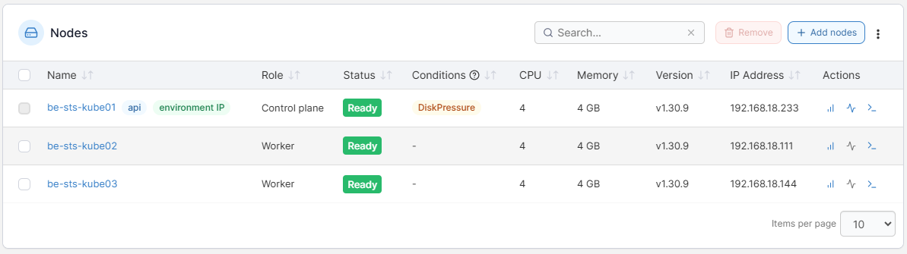

# What's new in version 2.27

Portainer version 2.27 includes a number of new fixes and updates. For a full list of changes, please refer to our [release notes](release-notes.md).



## Long Term Support (LTS)

2.27 is a Long Term Support, or "LTS", release of Portainer. LTS releases are intended to to be solid, tested, production-ready versions of Portainer, suitable for running in both testing and production environments. LTS releases generally do not have any additional features as compared to the previous STS release, but rather are a consolidation of all the new features and changes that have gone into the previous STS releases but with additional polishing and testing.

You can read more about our release principles in our [lifecycle policy](start/lifecycle.md).

As many users will be coming to this LTS release directly from the previous LTS release (2.21), the features listed below include those from previous STS releases.&#x20;

## New features

### Podman support  

This release brings official Podman support to Portainer. You can now [install Portainer Server on Podman environments](start/install/server/podman/) as well as [add Podman environments to an existing Portainer installation](admin/environments/add/podman/), just like Docker and Kubernetes environments through the environment wizard, and are managed in just the same way. You can deploy containers and stacks, pull images, inspect logs, and everything else you'd expect on your Podman environment.

At present, support is limited to rootful Podman 5 installations on CentOS 9. While other versions of Podman on other Linux distributions may work, we have not fully tested outside of the above options as of yet, and we hope to expand this in the future.

### Omni Integration &#x20;

We're excited to introduce our integration with Sidero's Omni platform in this release. With Omni, you can provision, configure and manage Talos Linux servers running Kubernetes environments right from the Portainer UI with [just a few clicks](admin/environments/add/kube-create/omni.md).

<figure><figcaption></figcaption></figure>

As our first release of this feature, there may be bugs or limitations with the implementation. We encourage you to provide constructive feedback so we can improve in future releases.


The Portainer and Sidero teams will be running a live demo and workshop of this integration at KubeCon Europe in London on the 1st of April! Spaces are strictly limited, so if you're interested you can [sign up here](https://www.portainer.io/events-kubecon-europe-april-2025)!


### Manage Kubernetes Jobs and Cron Jobs  

Adding to our management of Kubernetes object types, you can now view and manage [Cron Jobs and Kubernetes Jobs](user/kubernetes/more-resources/jobs.md) within Portainer.

<figure><figcaption></figcaption></figure>

You will find this functionality under [More resources](user/kubernetes/more-resources/) on Kubernetes environments.

### New Kubernetes security options 

There are some new Kubernetes security options available in this release, too. Administrators can now disable the Kubeconfig and Kube shell options on environments in Portainer, for situations where you might need to lock down access to that functionality.

### Ask the AI link 

Getting help within Portainer is now even easier. We've included a link on the top right of every page to our popular AI-powered chatbot, letting you get quick answers to your Portainer questions.&#x20;

<figure><figcaption></figcaption></figure>

The chatbot has been trained on the Portainer documentation, knowledge base, blog posts and the Portainer Academy as well as our GitHub issues and discussions, so is an excellent source of Portainer knowledge.

### Portainer support bundle 

If you do find yourself in a situation where the chatbot can't help and you need to reach out for help from our team, our new support bundle lets you submit your Portainer configuration data to the Portainer team for assistance. This feature strips out secure information like passwords before bundling so your information is kept safe.

<figure><figcaption></figcaption></figure>

## Enhancements and fixes

### Expanded ACI support 

This release also sees a significant amount of improvement to our support for ACI environments. When creating a container in an ACI environment you can now select a private virtual network, add tags, volumes, and GPUs. We've also expanded the management capabilities for your ACI workloads by adding stopping and restarting of ACIs as well as viewing of events related to those ACIs.

### Performance optimizations  

With every release we try to make using Portainer more responsive and performant, and 2.27 continues that trend. You'll notice much faster loading of pages within the app, more responsive searching, more reliable webhooks, more standardized interfaces, and all around a better experience.

We've also focused specifically on improving the performance of our Kubernetes management in this release, and the hard work has paid off. We're seeing significant improvements to load times for our Kubernetes pages within the app, much better responsiveness and an all around greater experience when managing Kubernetes in Portainer.

### Smaller Git clones  

Along with the general performance improvements, we've focused specifically on improving how we clone Git repositories when deploying stacks or applications from Git. We now perform much smaller Git clones, significantly reducing the amount of bandwidth and storage used to deploy from Git and as a result, making deployments faster.

### Added conditions to Kubernetes nodes  

To give you a better idea of the status of your Kubernetes nodes, we've added the Conditions column to the Kubernetes node view in this release.&#x20;

<figure><figcaption></figcaption></figure>

This column displays whether any of your nodes are affected by conditions, for example DiskPressure, MemoryPressure, PIDPressure or NetworkUnavailable.

### Edge Stacks: Staggered deployment improvements 

This release sees improvements to the staggered deployment functionality for Edge Stacks. Timeout values now apply to the batch when performing parallel deployments, helping avoid issues where a failed environment in a batch could halt the entire deployment unexpectedly.

### Improved logging  &#x20;

We've also made significant changes in how we log within Portainer, in particular for OAuth authentication and for Edge devices. OAuth logs now have increased verbosity which should help with diagnosing issues with authentication timeouts. Edge API calls now give more information when they error, including the environment ID and name, which helps when dealing with lots of Edge environments.

### Additional option for session timeout  

In 2.27 we've expanded the [session timeout options](admin/settings/authentication/) for authentication to include a 30 minute option. This helps to meet with security requirements around session timeout as well as giving you more options to suit your particular needs.

### Updated third-party binaries and libraries  

As we do with every release, we’ve updated the versions of the third party binaries and libraries that we use within Portainer to newer versions. This resolves a number of reported CVEs as well as providing improved performance and functionality.

### Removal of included Docker Compose binary  

In our ongoing efforts to rely less on third-party systems, we've removed the Docker Compose binary that we used to embed with the Portainer image, and instead we're now using our own integrated system for stack and compose functionality. This lets us avoid any potential CVEs within the Docker Compose binary, resulting to a more secure image, and has also improved performance when dealing with stacks.
