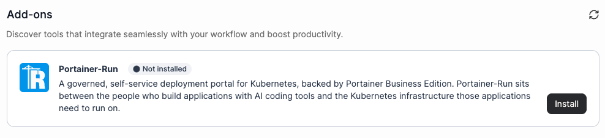
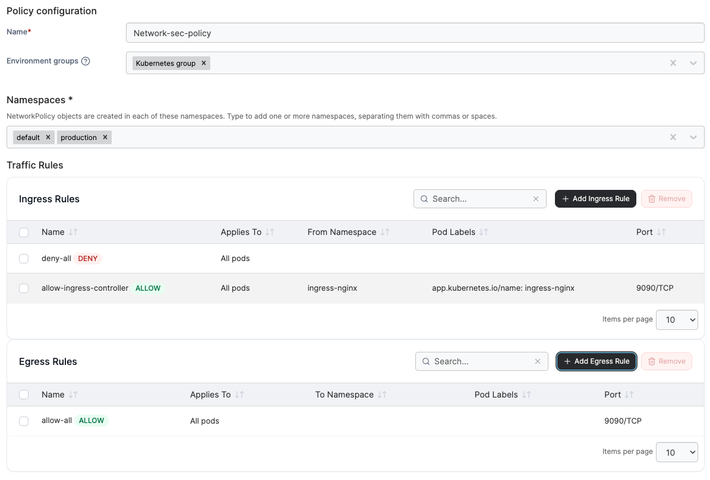
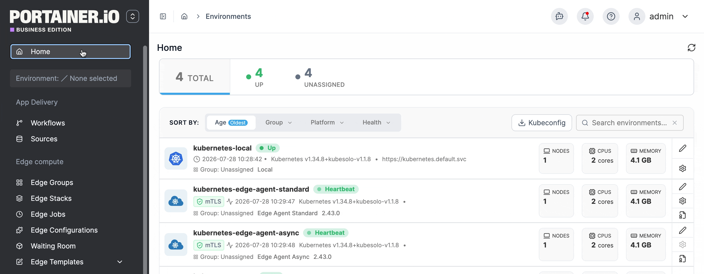
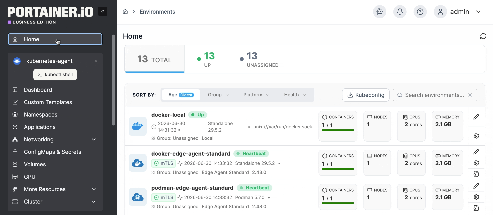
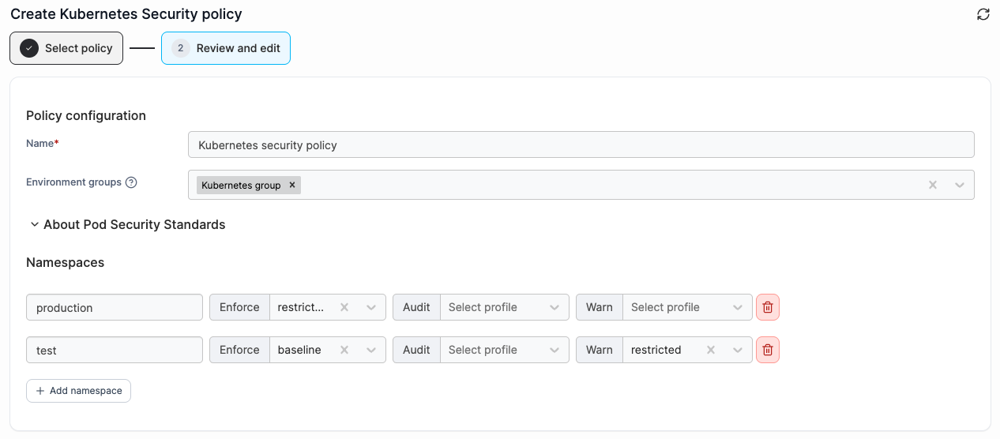
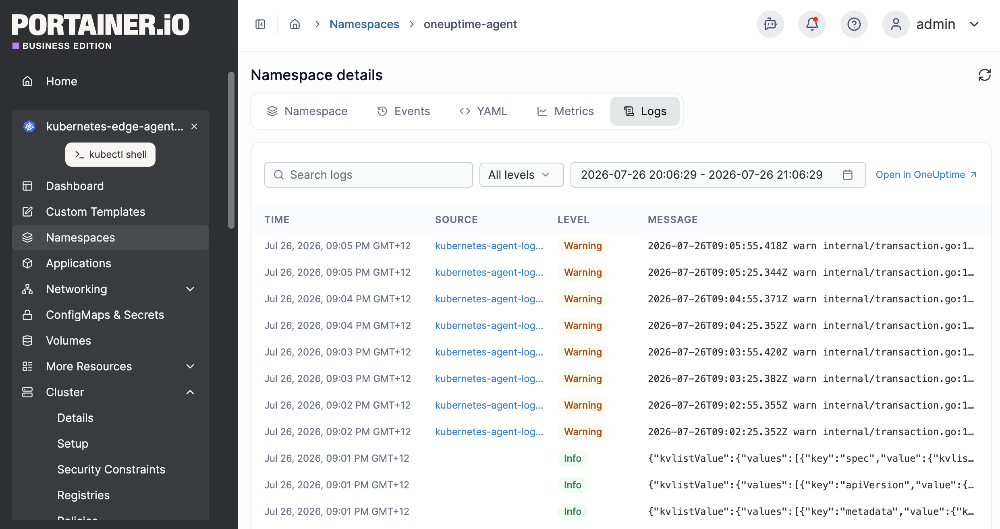
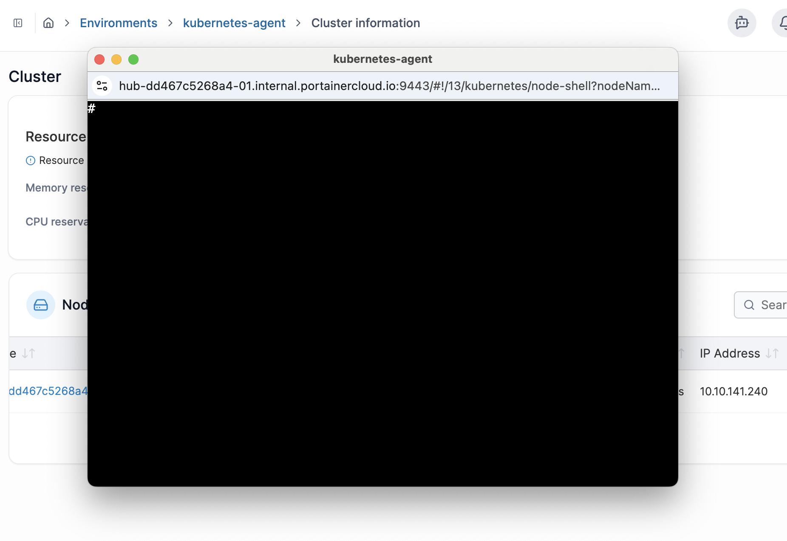

# What's new in version 2.44

Portainer version 2.44 includes a number of new features, fixes and updates. For a full list of changes, please refer to our [release notes](release-notes.md).

## Short Term Support (STS) 

2.44 is a Short Term Support, or "STS", release of Portainer. STS releases intended to be an introduction of new features and functionality in Portainer, and while we do perform significant testing prior to release are not recommended for production use. For production, we recommend staying with the Long Term Support (LTS) releases. The features that appear in STS releases will, once refined and stable, be implemented in the next LTS release.

You can read more about our release principles in our [lifecycle policy](https://docs.portainer.io/sts/start/lifecycle).

## New in this release

### Portainer Add-ons  &#x20;

Portainer now supports installable [add-on applications](admin/add-ons/) - purpose-built tools that extend Portainer with additional capabilities and run directly alongside it in your local Kubernetes cluster.&#x20;

Each add-on is deployed as a Helm release and appears as a separate tool in the Portainer sidebar switcher, letting users move between Portainer and its add-ons without leaving the interface. Admins can install, upgrade, restart, and uninstall add-ons from a central catalog, monitor their health through dedicated Resources, Events, and Logs tabs, and control which teams have access.&#x20;

Check out the first Portainer Add-on, [Portainer-Run](https://portainer.ai/), and let us know what you think on [GitHub discussions](https://github.com/orgs/portainer/discussions).

<figure><figcaption></figcaption></figure>

### **Kubernetes Network Security Policy** &#x20;

The new [Kubernetes network security policy](admin/environments/policies/kubernetes-policies/create-a-kubernetes-network-security-policy.md) now lets admin users define ingress and egress traffic rules for Kubernetes pods without writing manifests. Choose from presets - block all inbound, allow from a namespace, permit Prometheus scraping, restrict outbound while keeping DNS, and more - or build custom rules targeting pods by label or expression. Policies are automatically deployed as native Kubernetes `NetworkPolicy` objects via Helm across all environments in the assigned group.

<figure><figcaption></figcaption></figure>

### GitOps workflow creation  &#x20;

You can now create a complete [GitOps deployment workflow](user/app-delivery/workflows/add-a-new-workflow.md) in a single guided flow. From selecting a source and stack file, to configuring deployment targets, environment variables, registry settings, and rollout strategy (including parallel batches with automatic pause or rollback on failure). Once created, Portainer creates the workflow, the stack, and begins deploying in one operation.

<figure><figcaption></figcaption></figure>

### GPU visibility &#x20;

Kubernetes environments with detected GPU nodes now display a [dedicated GPU view](user/kubernetes/gpu.md) with three tables. The **GPU** table shows node readiness and a per-resource-type breakdown of GPU capacity, allocatable, allocated, and available counts, plus total and degraded node counts. The **GPU Nodes** table lists each node with its GPU capacity, allocatable, and allocated counts, along with a status badge and reason if not ready. The **GPU Workloads** table lists pods with GPU requests, showing namespace, pod name, owner workload, GPU requested, scheduled node, status, and any scheduling issues.

<figure><figcaption></figcaption></figure>

### Pod Security Standards policy for Kubernetes namespaces  &#x20;

You can now apply Kubernetes' built-in [Pod Security Standards](admin/environments/policies/kubernetes-policies/create-a-kubernetes-pod-security-standards-policy.md) to a namespace directly from Portainer using a policy. Choose a `privileged`, `baseline`, or `restricted` profile independently for each mode (`enforce`, `audit`, `warn`), giving you fine-grained control over how strictly pods are validated per namespace.&#x20;

<figure><figcaption></figcaption></figure>

### **Kubernetes observability policy** &#x20;

You can now define a [Kubernetes observability policy](admin/environments/policies/kubernetes-policies/create-a-kubernetes-observability-policy.md) to connect Portainer to your [OneUptime ](https://oneuptime.com/)instance, bringing logs and metrics directly into the namespace details view. Choose to connect to an existing OneUptime agent or have Portainer deploy one for you, then view log and metric data for environments within your policy groups right from Portainer.

<figure><figcaption></figcaption></figure>

### **A dedicated node shell** &#x20;

Administrators can now open a root shell directly on any cluster node from the [Nodes table](user/kubernetes/cluster/details/#nodes), without needing SSH. The feature is disabled by default and can be enabled per cluster in Cluster → Setup → [Security](user/kubernetes/cluster/setup.md#security), or centrally through a [Kubernetes Security Policy](admin/environments/policies/kubernetes-policies/kubernetes-security-policy.md).

<figure><figcaption></figcaption></figure>

### Portainer MCP Server  

Portainer now ships an [MCP server](advanced/portainer-mcp-server.md), generated from the Portainer OpenAPI spec, that exposes the platform's API as MCP tools - list environments, manage GitOps workflows, and troubleshoot Docker and Kubernetes resources from any MCP-compatible client. Install locally in minutes with a one-click bundle, or deploy as a container so your whole team can connect, each acting under their own Portainer permissions.
