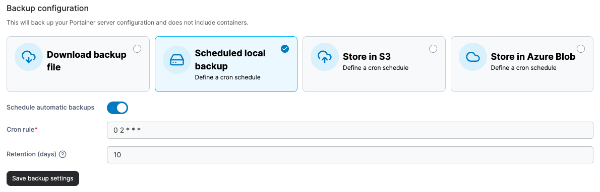
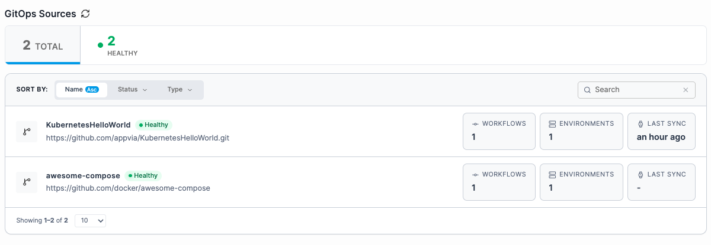

---
metaLinks:
  alternates:
    - https://app.gitbook.com/s/Dalese9Lv4CX6YKS1s45/whats-new
---

# What's new in version 2.42

Portainer version 2.42 includes a number of new fixes and updates. For a full list of changes, please refer to our [release notes](release-notes.md).

## Short Term Support (STS) 

2.42 is a Short Term Support, or "STS", release of Portainer. STS releases intended to be an introduction of new features and functionality in Portainer, and while we do perform significant testing prior to release are not recommended for production use. For production, we recommend staying with the Long Term Support (LTS) releases. The features that appear in STS releases will, once refined and stable, be implemented in the next LTS release.

You can read more about our release principles in our [lifecycle policy](https://docs.portainer.io/sts/start/lifecycle).

## New in this release

### New ways to back up Portainer &#x20;

This release introduces two new backup options for Portainer.&#x20;

[Scheduled local backup](admin/settings/general.md#scheduled-local-backup) allows admin users to automatically back up their configuration on a defined cron schedule, with configurable retention and support for custom storage paths via the `PORTAINER_BACKUP_PATH` environment variable.&#x20;

[Store in Azure Blob](admin/settings/general.md#store-in-azure-blob) adds Azure Blob Storage as a backup destination, joining S3 as a supported cloud storage option, and supports both on-demand and scheduled backups.&#x20;

<figure><figcaption></figcaption></figure>

### GitOps Sources   

Portainer now includes a dedicated [Sources](user/app-delivery/sources.md) view, providing a central place to view all external sources connected to your Portainer instance. From a single screen, you can view all the source details, and see at a glance how many workflows and environments each source is connected to. Keep an eye on this page as we continue to expand its functionality.

<figure><figcaption></figcaption></figure>

### Alerting improvements  

[Alerting](user/alerting.md) sees several improvements in this release. Select alert types now support multi-severity thresholds for specifying critical, warning, and info levels, while the rules view gains category-based grouping and filtering. New Kubernetes rules cover etcd, API server, TLS certificate expiry, and NotReady nodes, and alert summaries now surface meaningful per-entity context for faster triage.

<figure><figcaption></figcaption></figure>

### Kubernetes volumes page restructure and improvements   

In this release, the previous Volumes and Storage tabs found on the [Kubernetes volumes page](user/kubernetes/volumes/) have been replaced with three sections - Persistent Volumes, Persistent Volume Claims, and Storage Classes - giving each resource type its own focused view. You can now edit a volume's reclaim policy and resize persistent volume claims directly from the Actions menu, and storage classes can be set as the cluster default with a single click.&#x20;

<figure><figcaption></figcaption></figure>
