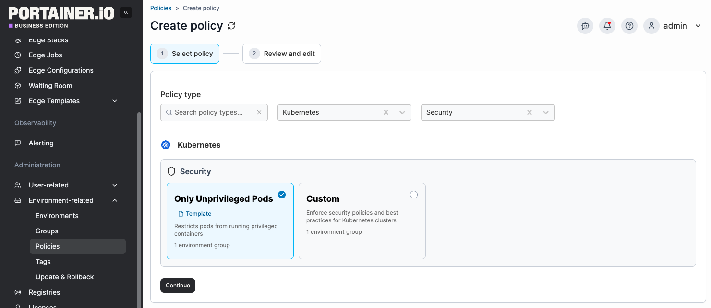

---
metaLinks:
  alternates:
    - https://app.gitbook.com/s/udjBY77rL45c6FTs07xf/whats-new
---

# What's new in version 2.38

Portainer version 2.38 includes a number of new fixes and updates. For a full list of changes, please refer to our [release notes](release-notes.md).

## Short Term Support (STS)

2.38 is a Short Term Support, or "STS", release of Portainer. STS releases intended to be an introduction of new features and functionality in Portainer, and while we do perform significant testing prior to release are not recommended for production use. For production, we recommend staying with the Long Term Support (LTS) releases. The features that appear in STS releases will, once refined and stable, be implemented in the next LTS release.

You can read more about our release principles in our [lifecycle policy](start/lifecycle.md).

## New in this release

#### Policy Based Management templates  

Since the initial release of [Policies](user/policy-based-management/policies/) as part of the Policy Based Management feature, improvements and new functionality has been added to simplify creating centralized policies across groups of environments.&#x20;

Along with [numerous fixes and UI improvements](release-notes.md#release-2.38.0-sts), this release introduces policy templates that provide preconfigured policies, making policy creation possible in just a few clicks. Templates are currently available for [Kubernetes security ](user/policy-based-management/policies/kubernetes/kubernetes-security-policy.md)and [Docker security](user/policy-based-management/policies/docker/security-policy.md) policies, with more to come in future releases.

<figure><figcaption></figcaption></figure>
