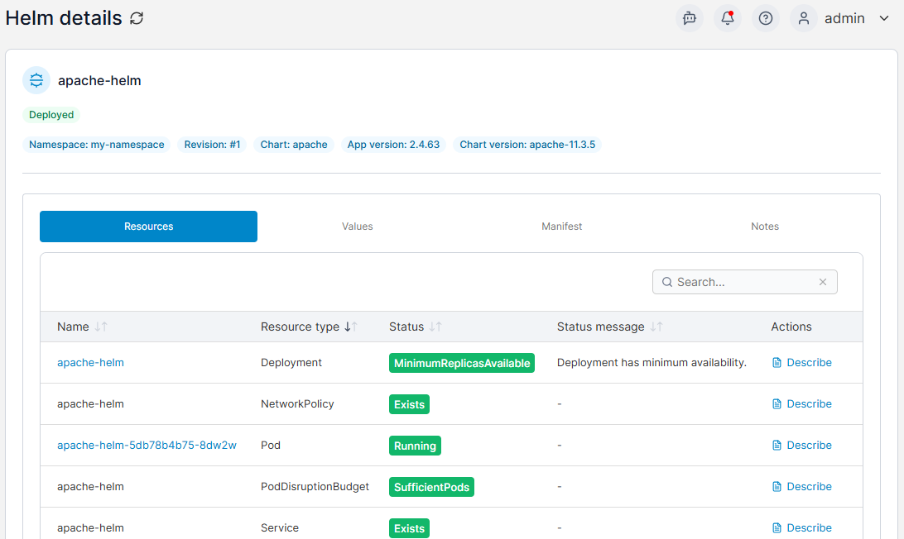
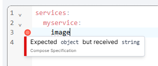
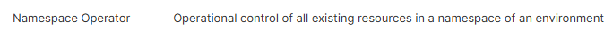

# What's new in version 2.29

Portainer version 2.29 includes a number of new fixes and updates. For a full list of changes, please refer to our [release notes](release-notes.md).

## Short Term Support (STS)

2.29 is a Short Term Support, or "STS", release of Portainer. STS releases intended to be an introduction of new features and functionality in Portainer, and while we do perform significant testing prior to release are not recommended for production use. For production, we recommend staying with the Long Term Support (LTS) releases. The features that appear in STS releases will, once refined and stable, be implemented in the next LTS release.

You can read more about our release principles in our [lifecycle policy](start/lifecycle.md).

## New in this release

### Helm Details  

2.29 brings a brand new view of Helm deployments to Portainer. Clicking on a Helm deployment within the Applications list takes you to the new Helm details page, which provides a ton of information about the deployment's status and configuration.

<figure><figcaption></figcaption></figure>

### Code completion and validation for Docker Compose  

To help users ensure their stack files are valid when being written and before deployment, 2.29 introduces code completion and validation functionality to the Web editor. If you've used Visual Studio Code or other IDEs that provide code hints, you'll be familiar with this kind of feature.

<figure><figcaption></figcaption></figure>

At present this functionality is available for Docker Compose only, but we hope to extend this to include validation for Kubernetes manifests in a future release.

### Namespace Operator role 

For Kubernetes users, we've added a new RBAC role in 2.29 - Namespace Operator. This role has the same permissions as the standard Operator role, but applied specifically to assigned namespaces instead of the entire cluster. This provides additional flexibility to administrators when providing access to resources on clusters.

<figure><figcaption></figcaption></figure>

### Performance optimizations  

With every release we try to make using Portainer more responsive and performant, and this release is no exception. We continue to migrate more of our views to the React framework, and have made changes to how often we pull raw Docker snapshots, resulting in significantly faster load times.

### mTLS improvements &#x20;

2.29 brings more updates to our mTLS functionality. You can now view details of your mTLS certificates within the UI from the Edge Compute settings as well as the mTLS status (and any errors) on individual environments from the home page.&#x20;
