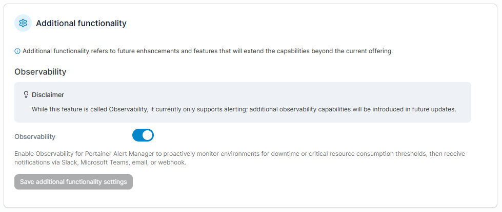

# What's new in version 2.34

Portainer version 2.34 includes a number of new fixes and updates. For a full list of changes, please refer to our [release notes](release-notes.md).

## Short Term Support (STS)

2.34 is a Short Term Support, or "STS", release of Portainer. STS releases intended to be an introduction of new features and functionality in Portainer, and while we do perform significant testing prior to release are not recommended for production use. For production, we recommend staying with the Long Term Support (LTS) releases. The features that appear in STS releases will, once refined and stable, be implemented in the next LTS release.

You can read more about our release principles in our [lifecycle policy](start/lifecycle.md).

## New in this release

### Registry management improvements &#x20;

As part of the transition from Angular to React, we've refactored the registry [repository management](admin/registries/manage.md) view. We've simplified tag addition and deletion, eliminating the need for manual batch loading of tags.&#x20;

<figure><figcaption></figcaption></figure>

### Add shared Git credentials  

You can now [add Git credentials from the Shared Credentials](admin/settings/credentials/git.md) view. Shared Git credentials will be usable by any admin-level user, though they will not be able to view the credentials directly. Once added, these Git credentials can be selected directly when setting up a deployment, or when creating a custom Docker template.&#x20;

<figure><figcaption></figcaption></figure>

### Observability graduates from experimental 

In 2.32 we introduced the [Observability](user/observability/) experimental feature, allowing the configuration of alerting based on various rules such as an environment being down, a backup failing, high resource usage, and others. In 2.34 we've made a few tweaks to the feature, and as a result have graduated this feature out of experimental and into general availability.

Administrators can now activate the Observability feature under [Additional functionality](admin/settings/general.md#additional-functionality):

<figure><figcaption></figcaption></figure>

### YAML editor within the Node details view  

We've added the ability to view the node YAML within the [node details view](user/kubernetes/cluster/node.md). Within Portainer Business Edition, you can also apply changes to this YAML.

<figure><figcaption></figcaption></figure>

### Helm manifest viewer when creating or upgrading a Helm chart  

When [creating](user/kubernetes/applications/manifest.md) or [updating](user/kubernetes/applications/inspect-helm.md) a Helm chart, you will now be able to see a Manifest preview alongside the YAML view.&#x20;

<figure><figcaption></figcaption></figure>
