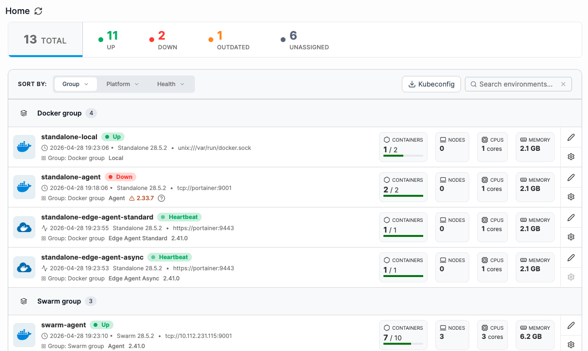
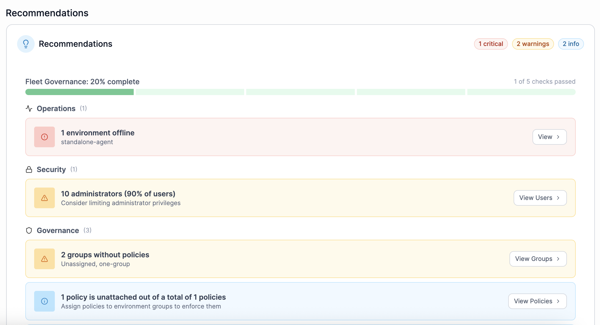
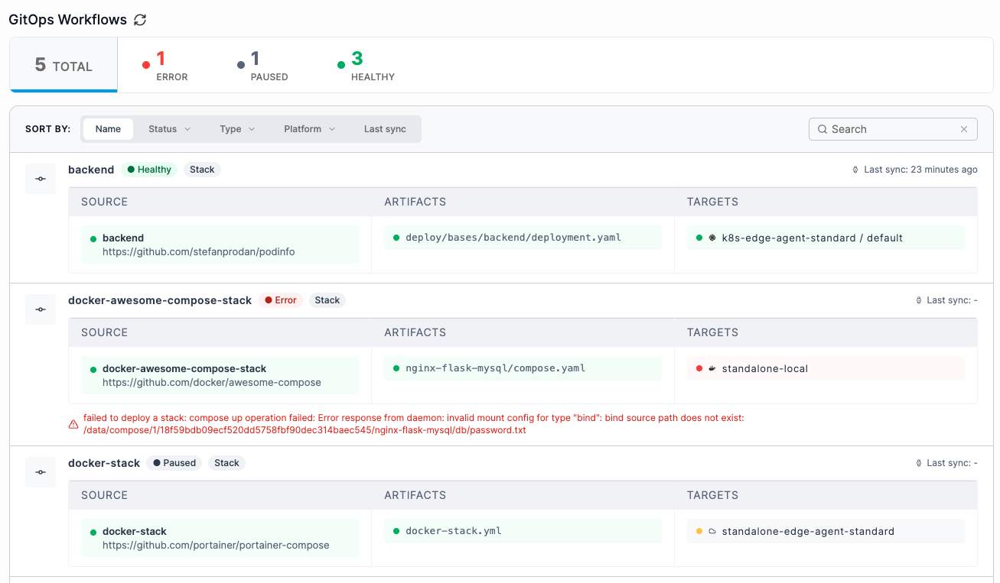
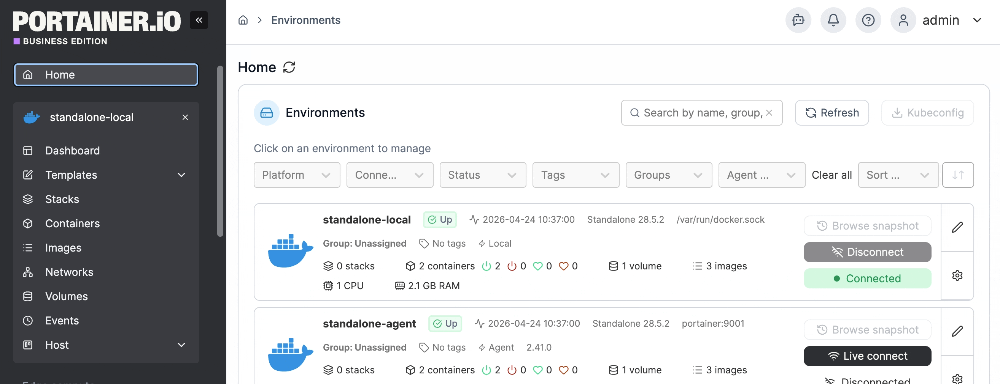
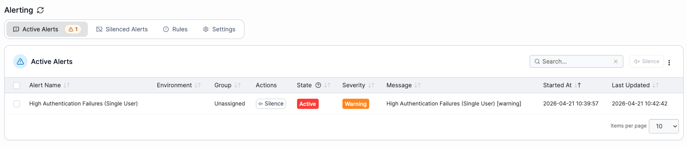

---
metaLinks:
  alternates:
    - https://app.gitbook.com/s/MdgxA76kWxcRmwybM8Ft/whats-new
---

# What's new in version 2.41

Portainer version 2.41 includes a number of new fixes and updates. For a full list of changes, please refer to our [release notes](release-notes.md).

## Short Term Support (STS) 

2.41 is a Short Term Support, or "STS", release of Portainer. STS releases intended to be an introduction of new features and functionality in Portainer, and while we do perform significant testing prior to release are not recommended for production use. For production, we recommend staying with the Long Term Support (LTS) releases. The features that appear in STS releases will, once refined and stable, be implemented in the next LTS release.

You can read more about our release principles in our [lifecycle policy](https://docs.portainer.io/sts/start/lifecycle).

## New in this release

### A new look for the home page   

The Portainer [home page](user/home/) has a new look. As part of our ongoing UI refresh, environments on the home page are now displayed in helpful groupings, making it easier to spot environments that are down or not assigned to a group. You can also sort environments by group, platform, or health.

<figure><figcaption></figcaption></figure>

### New Recommendations view 

Introducing Portainer [Recommendations](admin/recommendations.md). This new view will help you get the most out of your Portainer setup by surfacing actionable suggestions when it detects environment issues or Portainer configuration gaps. Each recommendation includes a direct action to take you straight to the relevant area of Portainer to resolve it.

<figure><figcaption></figcaption></figure>

### New Workflows dashboard  

The new [Workflows](user/workflows.md) dashboard provides a unified view of all Docker, Edge, and Kubernetes workloads deployed from a Git repository. Quickly assess deployment health across your environments and jump directly to any stack or application that needs attention.

<figure><figcaption></figcaption></figure>

### **Docker image prune**  

Keeping your Docker environments tidy is now easier with the introduction of [image pruning](user/docker/images/prune-dangling-and-unused-images.md). You can now prune directly from the Images view, with the option to remove only dangling images or extend the cleanup to all unused images.&#x20;

<figure><figcaption></figcaption></figure>

### Improvements to Alerting 

[Alerting](user/alerting.md) is now generally available, having graduated from being behind the Additional Functionality feature flag. This release brings several improvements to alerts, including clearer rule configuration and the ability to scope rules to specific environment groups.

Notifications can be sent to Slack, Email, or Microsoft Teams. [We'd love to hear your feedback](https://github.com/orgs/portainer/discussions) as we continue to develop this feature.

<figure><figcaption></figcaption></figure>

### Manage Portainer using Terraform   

[Portainer can now be automated](whats-new.md#manage-portainer-using-terraform) using our [official Terraform provider](https://registry.terraform.io/providers/portainer/portainer/latest/docs), allowing you to manage Portainer resources through the Portainer API with Terraform. This lets you create and manage environments, users, teams, stacks, and other Portainer resources as code, and integrate Portainer into your existing Infrastructure as Code and CI/CD workflows.&#x20;

You can find a full walkthrough of how to deploy a Docker stack with Terraform in our [How-to articles](https://www.portainer.io/how-to/how-to-deploy-a-docker-stack-with-terraform).
