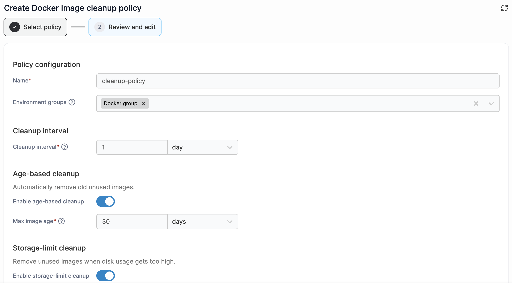
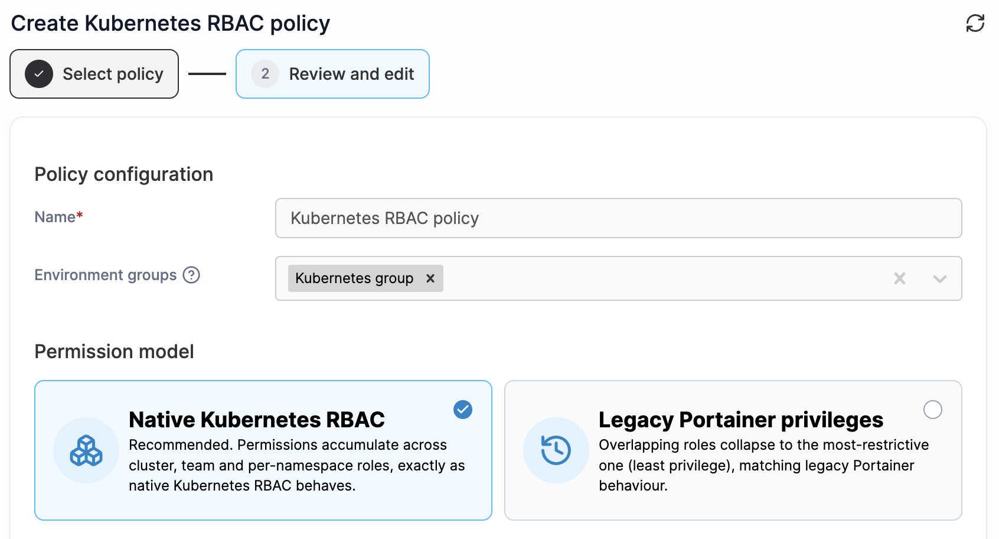
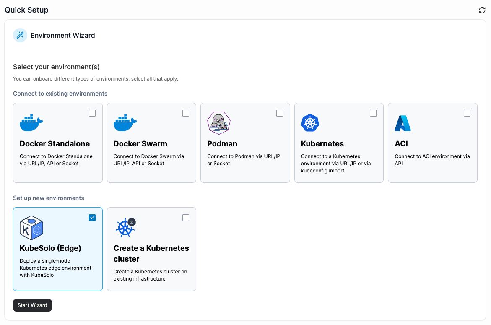
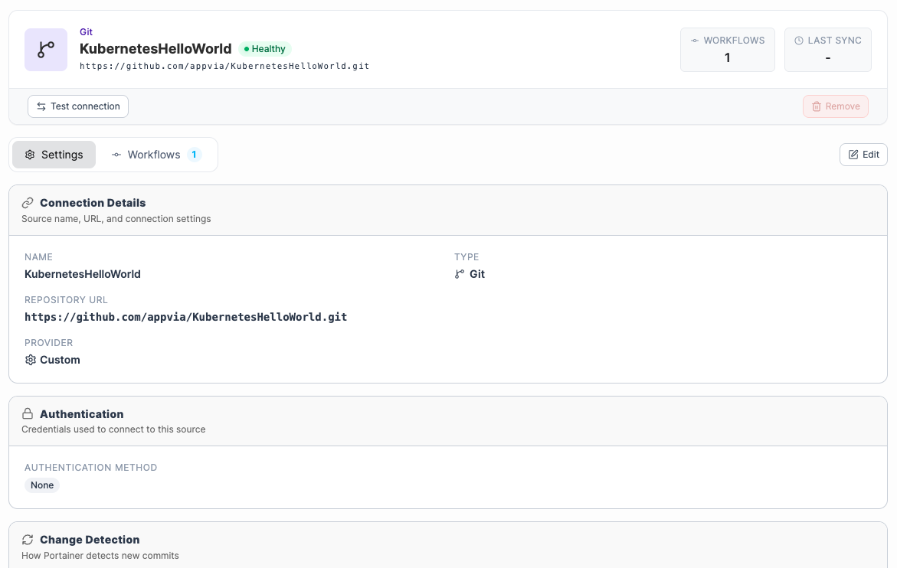
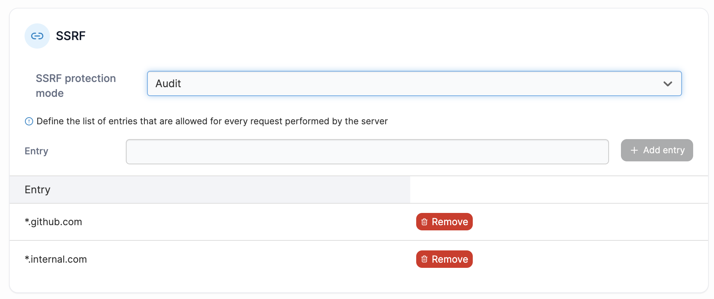

# What's new in version 2.43

Portainer version 2.43 includes a number of new features, fixes and updates. For a full list of changes, please refer to our [release notes](release-notes.md).

## Short Term Support (STS) 

2.43 is a Short Term Support, or "STS", release of Portainer. STS releases intended to be an introduction of new features and functionality in Portainer, and while we do perform significant testing prior to release are not recommended for production use. For production, we recommend staying with the Long Term Support (LTS) releases. The features that appear in STS releases will, once refined and stable, be implemented in the next LTS release.

You can read more about our release principles in our [lifecycle policy](https://docs.portainer.io/sts/start/lifecycle).

## New in this release

### Automated image cleanup policies &#x20;

You can now create an [image cleanup policy](admin/environments/policies/docker-policies/cleanup-policy.md) that automatically removes old and unused Docker images on a schedule, helping you reclaim disk space without manual intervention. Configure age-based or storage-threshold-triggered cleanup and protect specific images from removal.&#x20;

<figure><figcaption></figcaption></figure>

### Native Kubernetes RBAC support &#x20;

[Kubernetes RBAC policies](admin/environments/policies/kubernetes-policies/kubernetes-rbac-policy.md) now include a native Kubernetes permission model as an additional option alongside the existing legacy Portainer privileges model. With native Kubernetes RBAC, permissions accumulate across cluster, team, and namespace roles, aligning with standard Kubernetes expectations. This is the recommended option for new deployments.

<figure><figcaption></figcaption></figure>

### Add KubeSolo Edge Environments directly from Portainer &#x20;

Business edition users can now [onboard KubeSolo edge environments](admin/environments/add/add-a-kubesolo-edge-environment/) directly through the Portainer Environment Wizard.&#x20;

[KubeSolo](https://kubesolo.io/) is a lightweight, single-node Kubernetes distribution built for edge deployments. The wizard generates the setup command for your environment and walks you through deploying the Portainer Edge Agent - whether you're installing KubeSolo fresh or already have it running and just need to add the agent.

<figure><figcaption></figcaption></figure>

### Create and edit GitOps sources directly from the Sources view  

The [GitOps source](user/app-delivery/sources/) view is now the central place to manage your Git connections. Admin users can [create new GitOps sources](user/app-delivery/sources/add-a-new-source/) directly from this view - replacing the previous approach of entering Git credentials individually within each workflow. Connection details and authentication settings are also now editable in place.

<figure><figcaption></figcaption></figure>

### SSRF mitigation   

Portainer now includes built-in SSRF mitigation. A [new setting](admin/settings/general.md#ssrf) lets you define an allowlist of permitted proxy destinations and choose how Portainer responds to requests outside that list - blocking them (enforce mode), logging them (audit mode), or taking no action.

<figure><figcaption></figcaption></figure>
