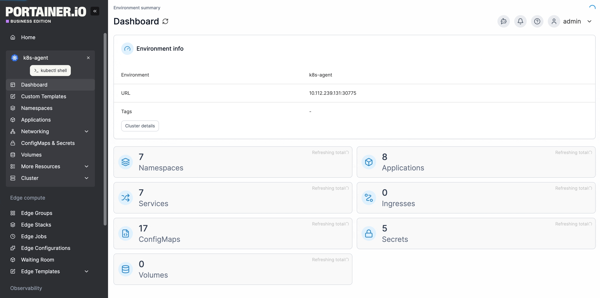
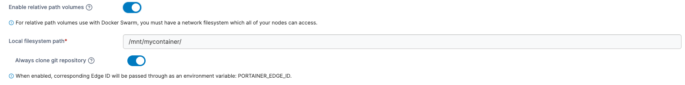

# What's new in version 2.35

Portainer version 2.35 includes a number of new fixes and updates. For a full list of changes, please refer to our [release notes](release-notes.md).

## Short Term Support (STS)

2.35 is a Short Term Support, or "STS", release of Portainer. STS releases intended to be an introduction of new features and functionality in Portainer, and while we do perform significant testing prior to release are not recommended for production use. For production, we recommend staying with the Long Term Support (LTS) releases. The features that appear in STS releases will, once refined and stable, be implemented in the next LTS release.

You can read more about our release principles in our [lifecycle policy](start/lifecycle.md).

## New in this release

### Automatic patch updates &#x20;

Portainer now supports [automatic patch updates](admin/settings/general.md#automatic-portainer-patch-updates), keeping your instance up to date with the latest patch releases. You can schedule when patches are applied, use a custom registry for air-gapped or restricted environments, and track applied updates in the Patch history table.&#x20;

This feature is in beta and should be used with caution in production environments.

<figure><figcaption></figcaption></figure>

### Git integration for Helm chart deployments &#x20;

Portainer now supports [deploying Helm charts directly from a Git source](user/kubernetes/applications/manifest/helm.md#git-repository), allowing you to manage Helm releases through your Git repository. You can view Git details for deployed Helm releases and see when a release is out of sync with its Git source. Applications created from Git [can also be edited](user/kubernetes/applications/edit-helm.md) and upgraded by modifying the Git settings directly within the application view.

<figure><figcaption></figcaption></figure>

### Always clone option for Edge stacks &#x20;

You can now choose to [always clone your Git repository](user/edge/stacks/add.md#always-clone-git-repository) when deploying Edge stacks that use relative path volumes. Enabling this option will ensure that Portainer automatically pulls the latest content from your Git repository to the target environment during deployment.

<figure><figcaption></figcaption></figure>
