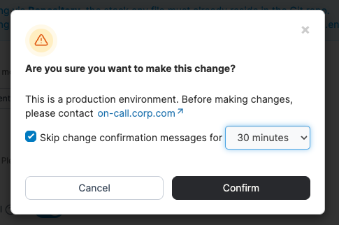
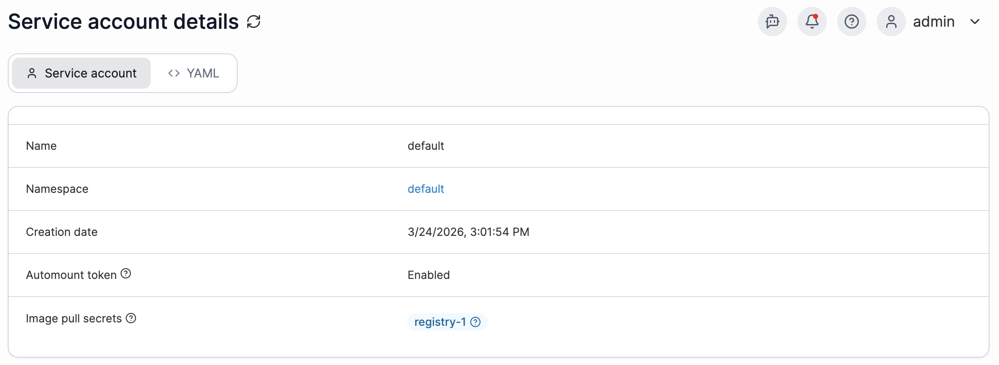

---
metaLinks:
  alternates:
    - https://app.gitbook.com/s/xdTQRpMuktD2l0URtOJO/whats-new
---

# What's new in version 2.40

Portainer version 2.40 includes a number of new fixes and updates. For a full list of changes, please refer to our [release notes](release-notes.md).

## Short Term Support (STS) 

2.40 is a Short Term Support, or "STS", release of Portainer. STS releases intended to be an introduction of new features and functionality in Portainer, and while we do perform significant testing prior to release are not recommended for production use. For production, we recommend staying with the Long Term Support (LTS) releases. The features that appear in STS releases will, once refined and stable, be implemented in the next LTS release.

You can read more about our release principles in our [lifecycle policy](https://docs.portainer.io/sts/start/lifecycle).

## New in this release

### Docker Compose to Kubernetes migration  

We've added an experimental feature that allows you to [migrate Docker Compose workloads to Kubernetes](user/docker/stacks/migrate.md#docker-compose-to-kubernetes-migration). Using the [Kompose conversion tool](https://kompose.io/), Portainer can translate your existing Docker Compose definitions into Kubernetes resources, helping streamline the transition between platforms. As this feature is experimental, it is not recommended for production use, and we strongly advise taking a backup before starting any migration.

<figure><figcaption></figcaption></figure>

### Banner and Custom Change Confirmation policy  

Portainer 2.40.0 introduces a new [Banner and Custom Change Confirmation policy](admin/environments/policies/any-environment-type-policies/create-a-banner-and-change-confirmation-policy.md).

This policy allows you to display a custom banner with your chosen text and color across a specified group of environments, helping users clearly distinguish between them. It also lets you configure a confirmation prompt that appears whenever a user applies a change to those environments, adding an extra layer of protection for sensitive workloads.

By combining visual identification with enforced confirmation, this policy helps reduce the risk of unintended changes while improving environment awareness.

<figure><figcaption></figcaption></figure>

<figure><figcaption></figcaption></figure>

<figure><figcaption></figcaption></figure>

### Default Service Account imagePullSecret management   

Portainer now automatically updates the default [Service Account](user/kubernetes/more-resources/service-accounts.md) in a namespace when registry access is added or removed as part of a [registry policy](admin/environments/policies/kubernetes-policies/kubernetes-registry-policy.md) (BE only) or from the [Registries view](user/kubernetes/cluster/registries.md#managing-access). When access is granted, the registry secret is added as an imagePullSecret to the default Service Account, allowing Pods in the namespace to pull images from the private registry automatically. When access is removed, the secret is removed from the default Service Account while any other existing imagePullSecrets are retained. This change is accompanied by an improved Service account details view, which allows you to view Service Account details and edit the YAML.

<figure><figcaption></figcaption></figure>
