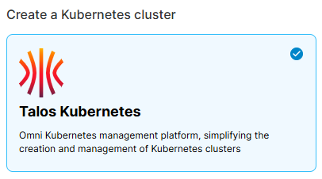
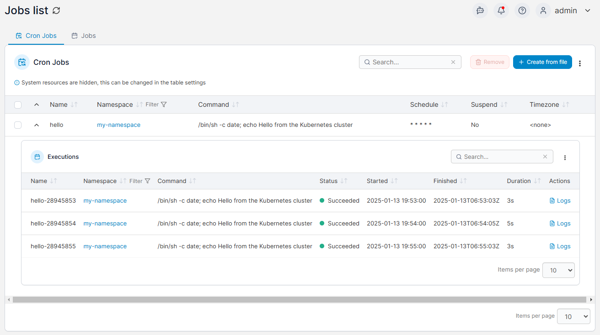

# What's new in version 2.26

Portainer version 2.26 includes a number of new fixes and updates. For a full list of changes, please refer to our [release notes](release-notes.md).

## Short Term Support (STS)

2.26 is a Short Term Support, or "STS", release of Portainer. STS releases intended to be an introduction of new features and functionality in Portainer, and while we do perform significant testing prior to release are not recommended for production use. For production, we recommend staying with the Long Term Support (LTS) releases. The features that appear in STS releases will, once refined and stable, be implemented in the next LTS release.

You can read more about our release principles in our [lifecycle policy](start/lifecycle.md).

## New in this Release

### Sidero Omni Integration &#x20;

2.26 brings our first release of our integration with Sidero Omni. With this integration, Talos Kubernetes clusters can be created and managed in Portainer through Omni in [just a few clicks](admin/environments/add/kube-create/omni.md).

<figure><figcaption></figcaption></figure>

As our first release of this feature, there may be bugs or limitations with the implementation. We encourage you to provide constructive feedback so we can improve in future releases.

### Manage Kubernetes Jobs and Cron Jobs  

Adding to our management of Kubernetes object types, you can now view and manage [Cron Jobs and Kubernetes Jobs](user/kubernetes/more-resources/jobs.md) within Portainer in 2.26.

<figure><figcaption></figcaption></figure>

You will find this functionality under [More resources](user/kubernetes/more-resources/) on Kubernetes environments.

### Additional option for session timeout  

In 2.26 we've expanded the [session timeout options](admin/settings/authentication/) for authentication to include a 30 minute option. This helps to meet with security requirements around session timeout as well as giving you more options to suit your particular needs.
